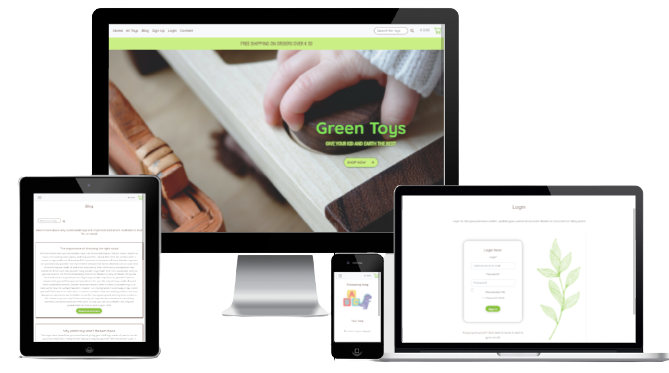

# Green toys webshop

This site is the Milestone Project 4 for the Software Development Diploma course at Code Institute. The project is aimed at displaying my 
understanding of full stack development with Django framework and building upon all previous learning in the course to put together a fully functional
website.

[A live version of the website can be viewed here](https://greentoys.herokuapp.com/)

The purpose of this site is to provide means for parents and others to buy eco-friendly toys for their children. The reasoning behind this is that children (at least in societal
contexts where economical conditions are strong) often have an abundance of toys, and these are more often than not made of different sort of plastics. As the manufacturing of plastics 
results in negative effects on the environment, many people find it important to try to avoid contributing to this by limiting or avoiding their use of plastic materials. When it comes
to toys, avoiding plastics can be percieved as important both for the sake of minimizing negative effects on the environment and because plastic toys can contain potentially harmful
substances. Because of this, many people find it especially important that the things that children use are made of environment-friendly materials that are free from harmful substances,
and there is therefore a need for providing such things as toys that are guaranteed to be tested for substances that can be harmful to children and that are made out of material that 
cause as little harm as possible to the environment. This website is aimed at providing an easy way for parents and others interested to purchase these kind of eco-friendly toys.

## UX

### Ideal client

The ideal client for this website is:

* Someone environmentally conscious

* A parent or someone else with children in their social circle

### Visitors to this site are looking for

* Buying a gift to a child

* Buying toys with a minimized negative impact on the environment

* Buying toys that are free from substances that can be harmful to children

* Finding more information about why eco-friendly toys are important and what effect different materials have on the environment

### This site is the best way to help them achieve this because:

* It only contains toys that fill the above criteria

* It provides user-friendly ways of searching and sorting the articles to find an eco-friendly toy of interest

* It provides easily accessed check-out options and register, login and logout of account

* It contains a blog with posts about eco-friendly toys, information about different materials toys can be made of and their impact on the environment

* The site is easy to navigate and well-designed to provide a positive user experience

### User stories

### Wireframes

1. As a site user, I want to be able to immediately get an overview of what products this site offers so that I can decide if it contains what I am looking for

2. As a shopper, I want to be able to view a list of products so that I can select some to purchase

3. As a shopper, I want to be able to view details about a specific product so that I can see a detailed description, larger image, price and rating of the product

4. As a shopper, I want to be able to easily view deals and special offers on products so that I can take advantage of special prizes on products that I am interested in buying

5. As a shopper, I want to be able to Easily see the total of all items in my shopping cart from all parts of the site so that I can avoid spending more money than I was planning to

6. As as a shopper I want to be able to easily see what rating different products have gotten so that i can see what others think of the product that I am interested in

7. As a shopper I want to be able to easily see what products have got the highest ratings so that I can find the most popular products

8. As a site user, I want to be able to find information about eco-friendly toys so that I can learn more about different materials and their impact on environment and why eco-friendly toys are important

9. As a site user I want to be able to comment on blog posts so that I ca ask questions and share my opinions on matters discussed in the blog post

10. As a site user I want to be able to easily register for an account so that I can have a personal account to come back to and view my profile

11. As a site user I want to be able to easily log in or out so that I can access my personal account information

12. As a site user I want to be able to easily recover my password in case I forget it so that I can regain access to my account

13. As a site user I want to be able to recieve a confirmation email after registering an account so that I can know that my account registration was successful

14. As a site user I want to be able to have a personalized user profile so that I can view my order history and see that my orders are confirmed and save my payment information

15. As a shopper I want to be able to select which category of products to show so that I can easily find a product within the category that I am interested in

16. As a shopper I want to be able to sort each chosen category of product by different parameters so that I can easily find the products with the best rating or lowest price in that category

17. As a shopper I want to be able to search for a product by name or description so that I can easily find a specific product that I am looking to buy

18. As a shopper I want to be able to easily see what I have searched for and the number of results so that I can identify miss-spellings in my search string and quickly overview the search result

19. As a shopper I want to be able to easily select a quantity of the product when adding it to my shopping bag, so that I an ensure I don't accidently select the wrong quantity

20. As a shopper I want to be able to easily view all items in my shopping bag so that I can identify the total cost and overview the items to be ordered

21. As a shopper I want to be able to change the quantity of a product in my shopping bag so that I can correct any mistakes in quantity of products before I order

22. As a shopper I want to be able to easily enter my payment information so that I can checkout quickly and easily

23. As a shopper I want to know that my personal and payment information is secure so that I can feel confident when providing the information needed to make a purchase

24. As a shopper I want to be able to view an order confirmation after checkout so that I can see that I haven't made any mistakes in my order

25. As a shopper I want to be able to recieve a confirmation email after ordering so that I can keep the information about what I have ordered and when for future needs

26. As a registered user I want to be able to have my address and billing information prefilled on the checkout page so that I can checkout quicker

27. As a store owner I want to be able to add a product to the site so that I can add new items to be sold in my store

28. As a store owner I want to be able to edit/update a product so that I can make changes to the products' images or descriptions when needed

29. As a store owner I want to be able to delete a product so that I can remove items that I am no longer selling

30. As a store owner I want to be able to add, update and delete blog posts so that I can write and maintain a blog about products-related topics

## Database design

## Security

An env.py file is used for storing details about database and Stripe connections. This file is not uploaded to Github.

## Design

* Color schema:
  The background color used on the site is a regular plain white, #fffff, which is chosen for creating an impression of airyness on the background by keeping it a color that goes by rather unnoticed. A brown umber nuance, #6D564D is used for headers and links in nav bar. It is chosen to create associations with nature and eco-friendliness, while also being a very warm color that aids in giving a calm an friendly impression to the site. Shopping bag icon and hero header has a bright green nuance, #81E157, that is chosen to create an impression of playfulness and happiness and associate with the sites target group - children. This is also the purpose of the light green complementary color #CAEF84 that is used on the header banner and hero button. The submit buttons have a slightly softer green color that is chosen to balance a bright and friendly impression, associate to nature while being a bit easier on the eye than the brighter green. The p elements on the site use a dark grey/light black color, #383636, that is chosen to create a softer impression and be easier on the eyes than a regular black color. 

* Imagery:
  The hero image - a closeup of a child's hand playing with a wooden toy, is chosen to create associations to robust and environmentally friendly toys that catches a child's interest (by showing a child engaged in play with this type of toy). The brown colors in the image also aid in creating associations with nature and naturalness that goes well with the site's 
  purpose. The drawn image of a green leaf appering on different pages on the site is chosen to represent an association to nature and environmental friendliness. The drawn images of toys and animals are chosen to create a feeling of playfulness and associate with kids and playing. The background pattern with light green leaves apperaring on some pages is chosen for the same purpose as the drawn image of leaf.

* Typography:
  The main header on the hero section on landing page, p elements and all headers on the site except for the subheader on the hero section has the font Quicksand. This font is chosen for its
  rounded shapes that create an impression of friendliness and somewhat of an association to childhood, while not being so round-shaped that it gets hard to read. The subheader on the hero section has the font Roboto, which is chosen to give a more serious impression (by its narrow shape) to accomodate well with this header's promoting message.

### Differences between wireframes and implemented design

* I originally intended to make the category selector on the toys page include the ability for the user to select only showing toys with campaign prices. This however completely slipped my mind during development and I realized it only when I was writing the testing section in the readme. Since this was not a core functionality of the page, and the time to submission deadline was running up, I decided to not build this functionality.

## Features

Navigation bar is present on all pages to ensure easily accessed navigation on the site. In the navbar is also a search bar where the user can search for toys on the site. Banner below navbar showing the free shipping threshold, and shortcut to shopping cart are also present on all pages to make sure that the customer easily can keep track of their shopping. There is also a footer with copyright info present on all pages.

### Index page

The index page consists of a hero section covering the full height of the screen, showing a large image with a header and a subheader on it clearly stating the name
of the site and with a call for action button below leading to the all toys page. Below the hero section on index page, the user finds a selection of toys that can be bought on this site - the four toys with the highest rating and four toys that are on campaign right now with lower prices. This is made to create an interest in looking at some of the toys sold on the site. The user also finds the four latest blog posts displayed here which is made to envoke an interest in exploring the blog. In this section there are also links to the all toys page and the blog page for easily accessed navigation.

### Toys page

On this page the user can find all toys for sale on the website, and choose to show only toys in the category 'wooden' or 'rubber', and sort toys by price or rating, highest to lowest or the opposite. On the card for each toy, there is an image of the toy (or a 'no image found' generic image if that toy has no image) a "read more"-button that takes the user to the toy details page. For superuser, the cards also contains an edit- and a delete- link that takes the superuser to an edit form for that toy, or to a confirmation page for deleting that toy.

### Search results page

If the user has searched for a toy on the site using the search bar in the navigation menu, the result is shown on the toys page along with a header saying what the user has searched for and how many results were found.

### Toy details page

The toy details page contains details about the toy that the user has clicked the "read more"-button on from the toys page. This page contains an image of the toy, a description of it and a button for adding the toy to the user's shopping cart, along with an input for choosing the amount of toys to add to the bag. Clicking the add to shopping bag-button will trigger a toast message that shows the user a feedback for the action. 

### Add toy page

This page is only available for superuser, and is accessed from the navigation bar (where it is only showed for signed in superuser). This page contains a form where the superuser can fill in name, description, rating and image and add a toy to the database by clicking "add toy". The page also contains a "cancel"-link that leads back to the toys-page when clicked.

### Edit toy page

This page is only available for superuser, and is accessed from the navigation bar (where it is only showed for signed in superuser). This page contains a form where the superuser can edit name, description, rating and image and add the updates to the database by clicking "edit toy". The page also contains a "cancel"-link that leads back to the toys-page when clicked.

### Confirm deletion page

This page is shown when superuser clicks the "delete"-link on a toy card. This page only contains a question "Are you sure you want to delete (name of the toy) ? and the choices yes or no. Clicking no takes the user back the toys page and clicking yes deletes the toy from the database.

### Shopping bag page

If the user has not added any toy to their bag, this page contains an info text saying that the user does not have any items in their bag yet, and a link to the toys page for a shortcut to shopping. If the user has added any items to their bag, this page shows what items are in the bag, the amount of them added and their price each and totally, along with shipping price and info about how much more the user has to by for to get free shipping (if that amount is not already exceeded). The shopping bag page contains a link back to the toys page in case the user wants to do more shopping, and a button that takes the user to the checkout page when clicked.

### Checkout page

The checkout page contains a summary of the users order with title of the items, price of each, amount of each, total of each, shipping cost and total cost. It also contains a form where the user fills in their shipping and payment details. For signed in users with this information saved to their profile, it is prefilled in this form. The page contains a link back to the toys page if the user wants to add more items to their bag, and a button for paying and checking out the order. 

### Blog page
The blog page contains a list of blog posts shown in the order of most recently added. The page also has a search box above the blog post where the user can search for a blog post either by title or by a word in the content. Each blogpost has a "read more"-link that when clicked takes the user to the blog details page. For a signed in superuser, there are also two additional links on each blogpost. One for editing, that takes the superuser to an edit blogpost page, and one for delete that takes the superuser for a confirm deletion page.

### Blog details page

The blog details page contains the entire text content of the blogpost shown, and if the user is signed in to their account a button saying "comment blogpost" is shown. If the user is not signed in, a text informing the user that they has to be signed in to comment is shown instead, along with a link to the login page and a link to the sign up-page to make it easy for the user to login or to create an account if they doesn't have one.

### Add blog page

This page is only available for superuser, and is accessed from the navigation bar (where it is only showed for signed in superuser). This page contains a form where the superuser can fill in title and content and add a blogpost to the database by clicking "add blogpost". The page also contains a "cancel"-link that leads back to the blogs-page when clicked.

### Edit blog page

This page is only available for superuser, and is accessed from the navigation bar (where it is only showed for signed in superuser). This page contains a form where the superuser can edit title and content and update a blogpost in the database by clicking "edit blogpost". The page also contains a "cancel"-link that leads back to the blogs-page when clicked.

### Confirm deletion page

This page is shown when superuser clicks the "delete"-link on a blogpost on the blog page. This page only contains a question "Are you sure you want to delete (title of the blogpost) ? and the choices yes or no. Clicking no takes the user back the blogs page and clicking yes deletes the toy from the database.

### My Profile page

This is a page where the user can see what personal info such as address and phone number is stored on their account, and change these if they need to. The page also displays the user's order history with a table showing the orders with order number and order dates so that the user can keep track of what they have ordered and when.

### Contact page

Contact page is available from navbar at the top of the page and from navigation links in footer, to be easily accessed by the user. The contact page contains a contact form for the user to send emails to the store if they have questions or want to give feedback or suggestions.

## Technologies used

* This site was built with HTML, CSS, Javascript and Python languages and with Python framework [Django](https://www.djangoproject.com/)

* The following Python modules were used in this project (can also be found in requirements.txt file):
    * django-countries=7.1
    * django-crispy-forms=1.11.2
    * django-storages=1.11.1
    * gunicorn=20.1.0
    * jmespath=0.10.0
    * oauthlib=3.1.0
    * Pillow=8.2.0
    * psycopg2-binary=2.8.6
    * PyJWT=2.0.1
    * python3-openid=3.2.0
    * pytz=2021.1
    * requests-oauthlib=1.3.0
    * s3transfer=0.4.2
    * sqlparse=0.4.1
    * standardjson=0.3.1
    * stripe=2.56.0
    * webhooks=0.4.2

* [Gitpod](https://gitpod.io/) is the IDE used to develop this site

* [Git](https://git-scm.com/) was used for version control

* [Github](https://github.com/) was used for hosting and store source code

* [Heroku](https://heroku.com) was used for deployment of live site

* [Heroku PostgresSQL](https://www.postgresql.org/) was used for relational database storage

* [jQuery](https://jquery.com/) was used for simplified use of javascript

* [Bootstrap](https://getbootstrap.com/) was used throughout the site for creating layout and responsiveness

* [Balsamiq](https://balsamiq.com/) was used for creating wireframes

* [Canva](https://www.canva.com/) was used for testing different colors and design and for getting the drawn images on the site

* [Google Fonts](https://fonts.google.com/) was used for importing the font used on the site

* [Font Awesome](https://fontawesome.com/) was used for icons 

* [Diagrams.net](https://www.diagrams.net/) was used for creating the database design schema

* [AWS S3 Bucket](https://aws.amazon.com/) was used for storing static and media files

* [Favicon](https://favicon.io/) was used to create the site's favicon 

* [Picresize](https://picresize.com/) was used for resizing images used on the site

* [Google Chrome Developer Tools](https://developer.chrome.com/docs/devtools/) was used for inspecting elements on the site to debug positioning and grid issues and test      
  responsiveness on different screen sizes

* [Unicorn Revealer Tool](https://chrome.google.com/webstore/detail/unicorn-revealer/lmlkphhdlngaicolpmaakfmhplagoaln?hl=en-GB) was used for analyzing positioning and grid 
  issues

* [WC3 Markup Validation Tool](https://validator.w3.org/) was used for for validating HTML code

* [Jigsaw CSS Validation Tool](https://jigsaw.w3.org/css-validator/) was used for validating CSS code

* [JSHint](https://jshint.com/) was used for validating Javascript code

* [Pep8 Online](http://pep8online.com/) was used for validating Python code 

* [Autoprefixer](https://autoprefixer.github.io/) was used for autoprefixing CSS code 

* [Free formatter CSS beautifier](https://www.freeformatter.com/css-beautifier.html) was used to ensure proper formatting of CSS code

* [Free formatter HTML beautifier](https://www.freeformatter.com/html-formatter.html) was used to ensure proper formatting of HTML code 

* [Lighthouse](https://developers.google.com/web/tools/lighthouse) was used in Chrome Dev tools version to test the site for acessibility and performance

## Testing

Information about testing is provided in a separate file, which can be viewed [here](TESTING.md)

## Deployment

### Project Creation

* The creation of this project on Github followed these steps:

    1. Navigate to [GitHub](https://github.com/) and sign in on the page

    2. When signed in to the page My Repositories is shown on the left side of the screen, and on top is a green button saying "New". Clicking this button leads to the page
       for creating a new repository

    3. On the page for creating a new repository, I chose the Code Institute Template from the options under "Repository templates"

    4. After entering a name for the project, click the green "Create Repository" button, which creates a repository hosting the project on GitHub

### Deployment to Heroku

* Create Heroku app:

  1. Navigate to [Heroku](https://heroku.com) and sign on the page

  2. When signed in, on the top right corner is a button saying "New". Clicking this button makes two options show - choose "Create app"

  3. Clicking the create app button leads to a new page, where I entered a name for the app and chose the region closest to my location and then clicked "Create app"

* Setup connection to Github repository

  1. Click on the tab saying "Deploy" and select Github - Connect to Github

  2. In the prompt showing after this, enter the name for the Github repository and click search

  3. When the repository is found, click the "connect" button

* Setup PostgresSQL Database

  1. Click on the tab saying "Resources" and go to "Add-ons"

  2. Search for Heroku Postgres and choose it in the appearing list

  3. Select the plan named "Hobby Dev - Free" and then click Submit order form

* Set enironment variables

  1. Click on the tab saying "Settings" and then click "Reveal config vars"

  2. Add the following variables:

    * AWS_ACCESS_KEY_ID

    * AWS_SECRET_ACCESS_KEY

    * DATABASE_URL

    * EMAIL_HOST_PASS

    * EMAIL_HOST_USER

    * SECRET_KEY

    * STRIPE_PUBLIC_KEY

    * STRIPE_SECRET_KEY

    * STRIPE_WH_SECRET

    * USE_AWS 

  The value of the above keys depend on the users personal setup and will not be added here for security reasons

* Enable automatic deployment

  1. Go to the tab saying "Deploy" again and scroll to the section "Automatic Deployment"

  2. Choose the branch you want to deploy from and then click "Enable Automation Deploys"

### Run project locally 

  1. Navigate to GitHub repository for this project

  2. Click the button on the top right saying "Code" and from the dropdown menu, choose if you want to download he project in a zip file, or copy the Git URL

  3. Open the IDE you want to work in and either:

    * open a terminal window in the directory you choose and type in the "git clone" command followed by the copied URL or for zip file

    * open the downloaded files from your IDE

  4. Install the required packages for the projects by entering the following command in the shell: pip install -r requirements.txt 

### Fork Project

  1. Navigate to GitHub repository for this project

  2. Click the button on the top right saying "Fork"

  3. A duplicate of the project is now created in your Github repository

## Credits

### Content

All content on the site is written by Isabelle Ängsås

### Media

* Photos of the toys "for sale" on the site are property of Isabelle Ängsås

* Background photo on hero section is from [Unsplash](https://unsplash.com/), photographer username Sigmund

* All drawn images on the site are from [Canva](https://www.canva.com/)

### Code

* This project was developed based on the understanding of the course material "Boutique Ado" walkthrough project on Code Institute Full stack development course. Some of the  code is developed directly following the tutorial, customized to fit this site's purposes. Where this is the case it is commented in the code, as well as parts of the code where other tutorials have been followed closely or where the code is relying largely on some other source.

* Aside from the course material, some other tutorials have been used in developing this project:
   * [Corey Schafer Python Django Tutorial: Full-Featured Web App Part 6 - User Registration](https://www.youtube.com/watch?v=q4jPR-M0TAQ&t=1377s)
   * [Codemy Django Blog Tutorial](https://www.youtube.com/watch?v=hZrlh4qU4eQ)
   * [Django central: Building a blog comment system](https://djangocentral.com/creating-comments-system-with-django/)
   * [Codemy How to build a dentist's website - Contact page and sending emails with django](https://www.youtube.com/watch?v=w4ilq6Zk-08&list=PLXcnmXd-db_hO1v3SLAzVcNieoS_Tcn-6&index=6)
   * [Fellow Code Institute Student Guillermo Brachetta's Milestone 4 Project setup of custom 404 and 500 error pages](https://www.youtube.com/watch?v=4b3yvjcPLnk& list=PLXcnmXd-db_hO1v3SLAzVcNieoS_Tcn-6)

* [Stack Overflow](https://stackoverflow.com/) has been used throughout the project for understanding error messages from Django during development
* [Django documentaion](https://docs.djangoproject.com/en/3.2/) has been used throughout the project for understanding Django logic and functionalities 

## Acknowledgments

* Thanks to mentor Seun Owonikoko for guidance on the project

* Thanks to tutor support for assistance in debugging issues
